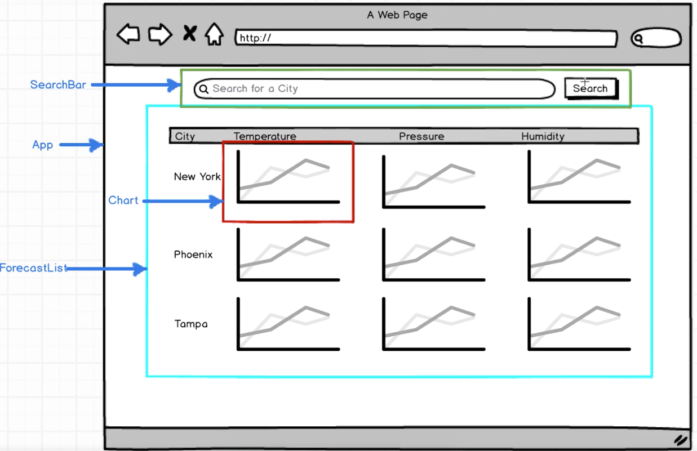
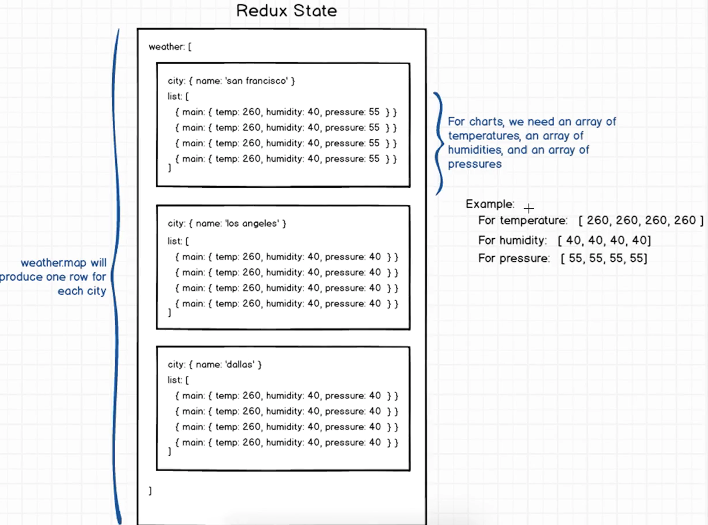

# React/Redux Weather Search App


## Getting Started

There are two methods for getting started with this repo.

#### Familiar with Git?
Checkout this repo, install dependencies, then start the gulp process with the following:

```
> git clone https://github.com/mojaray2k/amen-ra-react-redux-weather-forecast-search.git
> cd amen-ra-react-redux-weather-forecast-search
> npm install
> npm start
```

#### Not Familiar with Git?
Click [here](https://github.com/mojaray2k/amen-ra-react-redux-weather-forecast-search/archive/master.zipp) then download the .zip file.  Extract the contents of the zip file, then open your terminal, change to the project directory, and:

```
> npm install
> npm start
```
### Get A Open Weather Map API Key in order to Search for weather forecasts by City Name
1. Create a `vars.js` file in your `src/actions/` directory.
2. Go to [Open Weather Map Sign Up Page](https://home.openweathermap.org/users/sign_up) to create an account.
3. After signing up go to [API Keys](https://home.openweathermap.org/api_keys) to actually retrieve your **Open Weather Map** API key.
4. Then use it in your project like this:
* Inside of the `src/actions/index.js`
```javascript
import { openWeatherAPI_KEY } from './vars';

const WEATHER_API_KEY = openWeatherAPI_KEY;
```
* Inside your `src/actions/vars.js`
```javascript
// Sample API Key
const openWeatherAPI_KEY = `alkdfjasfjka;lskdfj;asldkjf;askdjfalfjdkajfsf`;
export {
  openWeatherAPI_KEY
}
```

### Redux State for the Weather List should look like the following:

